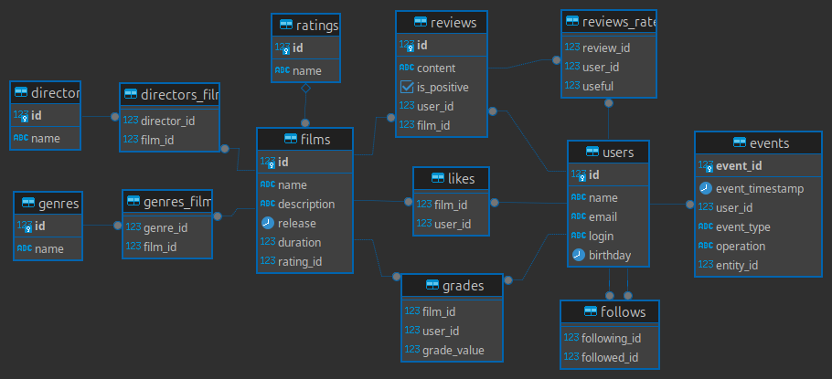

# java-filmorate 
## Cоциальная сеть для киноманов
* Проект выполнен на языке Java версии 11
* На основе Spring Boot 2.7.18
* C использованием H2 Database
## Последние изменения
### 1. Добавление режиссёров в фильмы
В информацию о фильмах добавлены имена режиссёров, что выражается в появлении следующей функциональности:
  * Вывод всех фильмов режиссёра, отсортированных по количеству лайков.
  * Вывод всех фильмов режиссёра, отсортированных по годам.
  * API `GET /films/director/{directorId}?sortBy=[year,likes]` 
  возвращает список фильмов режиссера отсортированных по количеству лайков или году выпуска
### 2. Удаление фильмов и пользователей
Добавлена функциональность для удаления фильма и пользователя по идентификатору.
  * API `DELETE /films/{filmId}` 
  Удаляет пользователя по идентификатору.
  * API `DELETE /users/{userId}`
  Удаляет фильм по идентификатору.

### 3. Вывод самых популярных фильмов по жанру и годам
Добавлена возможность выводить топ-N фильмов по количеству лайков. 
  * Фильтрация по двум параметрам. 
    * По жанру 
    * За указанный год
  * API `GET /films/popular?count={limit}&genreId={genreId}&year={year}`
  Возвращает список самых популярных фильмов указанного жанра за нужный год.

### 4. Функциональность «Отзывы»
  * В приложении появились отзывы на фильмы. 
  * Добавленные отзывы имеют рейтинг и несколько дополнительных характеристик.

Характеристики отзыва:
1. Оценка — полезно/бесполезно.
2. Тип отзыва — негативный/положительный.

  * Рейтинг отзыва.

У отзыва имеется рейтинг. При создании отзыва рейтинг равен нулю.
Если пользователь оценил отзыв как полезный, это увеличивает его рейтинг на 1.
Если как бесполезный, то уменьшает на 1.

Отзывы сортируются по рейтингу полезности.

* API
  * `POST /reviews` Добавление нового отзыва.
  * `PUT /reviews` Редактирование уже имеющегося отзыва.
  * `DELETE /reviews/{id}` Удаление уже имеющегося отзыва.
  * `GET /reviews/{id}` Получение отзыва по идентификатору.
  * `GET /reviews?filmId={filmId}&count={count}`
  Получение всех отзывов по идентификатору фильма, если фильм не указан то все. 
  Если кол-во не указано то 10.

- `PUT /reviews/{id}/like/{userId}` пользователь ставит лайк отзыву.
- `PUT /reviews/{id}/dislike/{userId}` пользователь ставит дизлайк отзыву.
- `DELETE /reviews/{id}/like/{userId}` пользователь удаляет лайк/дизлайк отзыву.
- `DELETE /reviews/{id}/dislike/{userId}` пользователь удаляет дизлайк отзыву.

Описание JSON-объекта с которым работают эндпоинты:
```json
{
    "reviewId": 123,
    "content": "This film is sooo baad.",
    "isPositive": false,
    "userId": 123, // Пользователь
    "filmId": 2, // Фильм
    "useful": 20 // рейтинг полезности 
}
```
### 5. Функциональность «Лента событий».
Добавлена возможность просмотра последних событий на платформе
  * добавление в друзья, 
  * удаление из друзей, 
  * лайки и отзывы, которые оставил пользователь.

  * API `GET /users/{id}/feed` Возвращает ленту событий пользователя.

Пример JSON-объекта с которым работает эндпоинт:
```json
[
    {
        "timestamp": 123344556,
        "userId": 123,
        "eventType": "LIKE", // одно из значениий LIKE, REVIEW или FRIEND
			  "operation": "REMOVE", // одно из значениий REMOVE, ADD, UPDATE
        "eventId": 1234, //primary key
        "entityId": 1234   // идентификатор сущности, с которой произошло событие
    }
]
```
### 6. Функциональность "Рекомендации"
Примерный алгоритм выглядит следующим образом:

1. Найти пользователей с максимальным количеством пересечения по лайкам.
2. Определить фильмы, которые один пролайкал, а другой нет.
3. Рекомендовать фильмы, которым поставил лайк пользователь с похожими вкусами, 
а тот, для кого составляется рекомендация, ещё не поставил.
* `GET /users/{id}/recommendations` Возвращает рекомендации по фильмам для просмотра.
### 7. Функциональность «Поиск»
Реализован поиск по названию фильмов и по режиссёру.
Алгоритм умеет искать по подстроке.
* API `GET /fimls/search` Возвращает список фильмов, отсортированных по популярности.
* Параметры строки запроса
  * `query` — текст для поиска
  * `by` — может принимать значения `director` (поиск по режиссёру), `title` (поиск по названию), 
  либо оба значения через запятую при поиске одновременно и по режиссеру и по названию.
  * Пример: `GET /films/search?query=крад&by=director,title`

### 8. Функциональность «Общие фильмы»
Вывод общих с другом фильмов с сортировкой по их популярности.
* API `GET /films/common?userId={userId}&friendId={friendId}`
Возвращает список фильмов, отсортированных по популярности.
* Параметры
  * `userId` — идентификатор пользователя, запрашивающего информацию;
  * `friendId` — идентификатор пользователя, с которым необходимо сравнить список фильмов.
### Диаграмма обновленной базы данных 

### Примеры запросов sql
* ####  Сохранить значения полей объекта в таблицу "example"
```sqlite-psql
INSERT INTO example (column_1, column_2, column_3, etc) 
VALUES(?, ?, ?, ?)
````
* ####  Получить id последнего сохраненного объекта в таблице, где id generated by default as identity not null primary key
```sqlite-psql
SELECT MAX(id) AS last 
FROM example
````
* ####  Получить поле из таблицы example по id
```sqlite-psql
SELECT column_name
FROM example
WHERE id = ?
````
* ####  Обновить рейтинг фильму
```sqlite-psql
UPDATE films 
SET rating_id = ?
WHERE id = ?
````
* ####  Получить жанр по id
```sqlite-psql
SELECT name 
FROM genres 
WHERE id = ?
````
* ####  Добавить фильму жанры
```sqlite-psql
INSERT INTO genres_films (genre_id, film_id)
VALUES(?, ?)
````
* ####  Обновить фильм без рейтинга
```sqlite-psql
UPDATE films 
SET name = ?,
    description = ?,
    release = ?,
    duration = ? 
WHERE id = ?
````
* ####  Обновить фильму рейтинг
```sqlite-psql
UPDATE films 
SET rating_id = ?
WHERE id = ?
````
* ####  Удалить все жанры конкретного фильма
```sqlite-psql
DELETE 
FROM genres_films
WHERE film_id = ?
````
* ####  Получить фильм без жанра
```sqlite-psql
SELECT name,
       description,
       release,
       duration 
FROM films 
WHERE id = ?
````
* ####  Получить id рейтинга фильма
```sqlite-psql
SELECT rating_id AS mpa_id
FROM films
WHERE id = ?
````
* ####  Получить рейтинг по id
```sqlite-psql
SELECT * 
FROM ratings
WHERE id = ?
````
* ####  Получить id жанров фильма
```sqlite-psql
SELECT genre_id AS id
FROM genres_films 
WHERE film_id = ?
````
* ####  Получить жанр по id
```sqlite-psql
SELECT * 
FROM genres
WHERE id = ?
````
* ####  Получить список лайков
```sqlite-psql
SELECT user_id AS id 
FROM likes 
WHERE film_id = ?
````
* ####  Получить id фильмов по порядку
```sqlite-psql
SELECT id 
FROM films 
ORDER BY id ASC
````
* ####  Поставить фильму лайк
```sqlite-psql
INSERT INTO likes (film_id, user_id)
VALUES(?, ?)
````
* ####  Удалить лайк у фильма
```sqlite-psql
DELETE 
FROM likes 
WHERE film_id = ? 
  AND user_id = ?
````
* ####  Получить топ 10 id фильмов по лайкам
```sqlite-psql
SELECT film_id AS id 
FROM likes
GROUP BY film_id
ORDER BY COUNT(user_id) DESC
LIMIT 10
````
* ####  Узнать получил ли фильм лайк от конкретного пользователя
```sqlite-psql
SELECT EXISTS (SELECT * 
               FROM likes
               WHERE film_id = ? 
                 AND user_id = ?) AS match
````
* ####  Узнать задан ли фильму сохраненному в БД рейтинг
```sqlite-psql
SELECT EXISTS (SELECT rating_id
               FROM films
               WHERE rating_id IS NOT NULL 
                 AND id = ?) AS match
````
* ####  Узнать есть ли запрашиваемый id в таблице "tableName"
```sqlite-psql
SELECT EXISTS (SELECT id AS match 
               FROM tableName
               WHERE id = ?) AS match
````
* ####  Обновить пользователя
```sqlite-psql
UPDATE users 
SET name = ?, login = ?, email = ?, birthday = ?
WHERE id = ?
````
* ####  получить подписчиков пользователя
```sqlite-psql
SELECT following_id 
FROM follows 
WHERE followed_id = ?
````
* ####  получить пользователя по id без подписчиков
```sqlite-psql
SELECT * 
FROM users 
WHERE id = ?
````
* ####  получить всех пользователей по порядку без подписчиков
```sqlite-psql
SELECT * 
FROM users 
ORDER BY id ASC"
````
* ####  подписаться
```sqlite-psql
INSERT INTO follows (following_id, followed_id) 
VALUES(?, ?)
````
* ####  отписаться
```sqlite-psql
DELETE 
FROM follows 
WHERE following_id = ? 
  AND followed_id = ?
````
* ####  получить общий подписчиков без их подписчиков (они же друзья)
```sqlite-psql
SELECT * 
FROM users AS u
JOIN follows AS f ON f.following_id = u.id 
                 AND f.followed_id = ?
JOIN follows AS friend_f ON friend_f.following_id = u.id 
                        AND friend_f.followed_id = ?"
````
* ####  получить всех подписчиков пользователя по id (без подписок подписчиков
```sqlite-psql
SELECT *  
FROM users u 
JOIN follows AS f ON f.following_id = u.id 
                 AND f.followed_id = ?;
````
* ####  получить id подписчиков пользователя
```sqlite-psql
SELECT following_id 
FROM follows 
WHERE followed_id = ?
````
* ####  получить все жанры по порядку id
```sqlite-psql
SELECT * 
FROM genres 
ORDER BY id ASC
````
* ####  получить жанр по id
```sqlite-psql
SELECT * 
FROM genres 
WHERE id = ?
````
* ####  получить все рейтинги по порядку id
```sqlite-psql
SELECT * 
FROM genres 
ORDER BY id ASC
````
* ####  получить рейтинг по id
```sqlite-psql
SELECT * 
FROM ratings
WHERE id = ?
````
